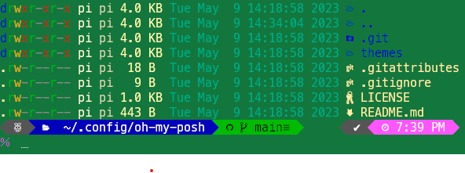

# README-prompt-rpi

Instructions on how to make your Raspberry Pi (and probably other Debian install) prompts to look like the following.



## Curl

Install

```bash
sudo apt install curl -y
```

## Git

Install

```bash
sudo apt install git -y
```

## Oh-My-Posh

Install

```bash
sudo wget https://github.com/JanDeDobbeleer/oh-my-posh/releases/latest/download/posh-linux-arm -O /usr/local/bin/oh-my-posh

sudo chmod +x /usr/local/bin/oh-my-posh
```

## Zsh

Install

```bash
sudo apt install zsh -y

git clone https://github.com/cscribn/config-zsh.git  ~/.config/zsh

cp ~/.config/zsh/zshrc-pi ~/.zshrc
```

## Vim

Install

```bash
sudo apt install vim -y

curl -Lo "$HOME/.vimrc" https://raw.githubusercontent.com/cscribn/config-misc/main/vim/vimrc
```
